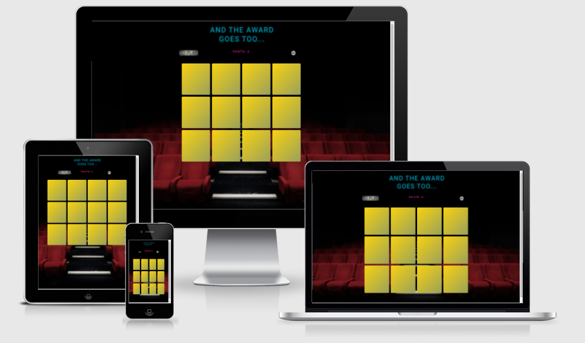

# MS2-And-The-Award-Goes-To...

**And-The-Award-Goes-To... Website**

Interactive Frontend Development Milestone Project - Code Institute.

The live website can be found [here]( )

**Overview**

Entertainment is a part of our daily lives and film, TV, music, games, books and theatre have become extremely important as a form of escape in the past year, where much of the world has experienced lockdown.

The aim of this project is to build an entertaining, interactive, and visually appealing card memory game web application, where players can experience increasing levels of difficulty to challenge abilities, using HTML, CSS and JavaScript.

Players will be provided with clear explanations on how to play the game and with clear feedback on how they&#39;re doing at any stage.

The main target audience for And The Award Goes To…. is fans of memory games and fans of entertainment awards, like the Oscars. The game can be enjoyed by everyone, though younger audiences may not be familiar with the names of the awards. However, there is a description of each award to inform players about the various awards.

**Features**

A simple single-player pattern-matching memory game.

## User Experience (UX)

**User stories**

**As a user I want to:**

- Play a game that is fun and exciting.
- Have the game to challenge my memory
- Easily access instructions on how to play
- Be able to read my score result
- Test my memory skills in a fun environment.
- Have options to increase the difficulty of the game as I progress
- Have easy-to-use controls.
- Find clear, easy-to-follow instructions on gameplay.
- Have clear audio and visual cues which show where I have clicked.
- Be able to play with and without audio.
- See visually rewarding images themed around Awards

**As a developer/site owner I want to:**

- Create a fun and interactive game that my friends and I would enjoy
- Design and develop a project using new-found skills in JavaScript and JQuery
- Be able to track my progress while playing
- Challenges the user
- Create a game that&#39;s fun and suitable for all ages
- Create a visually appealing site with clear game instructions
- Further develop my knowledge and skills in writing JavaScript &amp; jQuery code

## UX Design

**Scope**

For the audience I want to present a fun and enjoyable game that is easy to understand and can be accessed on mobile devices, laptops and desktops. If they enjoy the game they might tell their friends.

**Structure**

The original structure was for a multi-page site but this was abandoned as it would not fit the user needs. Instead, a single page site, split into sections with a navigation bar at the top linking to each section.

**Skeleton**

*[Wireframes](https://github.com/BabusDublinCoding/MS2-And-The-Award-Goes-To/tree/master/wireframes)*

- The wireframes were created using Balsamic, a popular wireframing tool, which Code Institute student can avail of as a fully licenced product.
- This was done during the early stages of the project and demonstrates the structure of the website on different devices including mobile, tablet and desktop.

- [Mobile Wireframes](https://github.com/BabusDublinCoding/MS2-And-The-Award-Goes-To/blob/master/wireframes/Mobile.png)
- [Tablet Wireframes](https://github.com/BabusDublinCoding/MS2-And-The-Award-Goes-To/blob/master/wireframes/Tablet.png) 
- [Desktop Wireframes](https://github.com/BabusDublinCoding/MS2-And-The-Award-Goes-To/blob/master/wireframes/Desktop.png)

**Surface**

*Design*

**Colour Scheme**

Colours associated with award ceremonies tend to be warm and vibrant colours. Red carpets and gold statues. I wanted to add a palette to the website to convey this, along with an image of glamour an sophistication.

Chili Pepper #F51720 Pink #FA26A0 Gold #F8D210 Cyan #2FF3E0

**Typography**

- Roboto was chosen as the font for this project as the font family for this website it is currently very popular in modern web design. It has a clean and elegant with a readable shape, which suits the refined style the website is trying to achieve. 

**Icons**

- Icons are from the Font Awesome library

## Features

**Existing**

- Logo &amp; head title- Identifies the theme and type of game

- Cursor changes to a pointer on items to click
- Modal appears on clicking &#39;To Play&#39; icon giving instructions on game play
- Sound icon, which enables/disables the audio
- Cards are &quot;shuffled&quot; when the game is loaded/restarted
- &quot;Shrink&quot; 3D effect to cards when clicked
- Cards &quot;flip over&quot; when clicked
- Image &quot;underneath&quot; the card is revealed when clicked
- Cards return to original state if there no matched pair
- Cards remain revealed if there is a matched pair
- Points counter increases by 5 for a correct match
- The points counter reduces by 2 for an incorrect match
- A variety of human sound effects play when there is a correct ,incorrect match or game finished
- &#39;Win&#39; modal shows on completion of game with final score
- &#39;Win&#39; modal has a button to &quot;play again&quot;

**Features to implement in the future:**

The original wireframes reflected a number features that I wanted to implement but did not have the time or the technical knowledge to carry them out. Also problems with my laptop and a woeful internet connection meant much of the coding was done in vs. Code.

- Include additional levels with perhaps 18 and 24 cards
- Lock each level until the previous level is completed
- Have a countdown timer which means the player can lose
- Include descriptions of awards
- Have a leader board of high scores

## Technologies Used

During the development and testing of the website:

- **Languages**

   - [HTML5](https://en.wikipedia.org/wiki/HTML): Used to structure the page

   - [CSS3](https://en.wikipedia.org/wiki/CSS): Used to style the different elements on the page
   
   - [JavaScript](https://en.wikipedia.org/wiki/JavaScript): Used to allow the game to produce relevant responses dependent on users' actions

- **Frameworks and libraries**
  - [Bootstrap 4.4](https://getbootstrap.com/docs/4.4/getting-started/introduction/): Bootstrap library was used to build the layout using the grid system
  - [Google font](https://fonts.google.com/): Used for the fonts on the website
  - [Font Awesome](https://fontawesome.com/): Used for the social media icons on the website

- **Media & wireframes**
  - [Balsamiq](https://balsamiq.com/wireframes/): To design the wireframes
  - [Paint 3D](https://www.microsoft.com/en-us/p/paint-3d/9nblggh5fv99?activetab=pivot:overviewtab): To design images
  - [WavePad](https://www.nch.com.au/wavepad/index.html?ns=true&amp;kw=wave%20pad&amp;gclid=Cj0KCQjwh_eFBhDZARIsALHjIKfnj_WuKa1xqegFYfzCjGZksWTPvto5lURMoxqVLK1FbNndX0ine5caAiq0EALw_wcB): To design and manipulate audio files
- **Workspaces & respository hosting**
  - [Gitpod](https://www.gitpod.io/): As a local repository to develop the code
  - [Visual Studio Code](https://code.visualstudio.com/): As a local repository to develop the code
  - [Git](https://git-scm.com/): For version control from gitpod to save commits and push code onto GitHub
  - [GitHub](https://github.com/): To save the code and deploy the live site
- **Testing**
  - [Chrome DevTools](https://developers.google.com/web/tools/chrome-devtools): Google inspect was used examine and test responsiveness
  - [Google Mobile Friendly Test](https://search.google.com/test/mobile-friendly?utm_source=gws&utm_medium=onebox&utm_campaign=suit): For additional mobile testing
  - [Google Lighthouse](https://developers.google.com/web/tools/lighthouse): Google lighthouse was used to assess performance of the site
  - [W3C HTML Validator](https://validator.w3.org/): To check there's no error in the HTML code
  - [W3C CSS Validator](https://jigsaw.w3.org/css-validator/): To check there's no error in the CSS code
  - [JavaScript Code Checker](https://jshint.com/) To check there's no errorJavaScript code

## Testing

- **Chrome DevTools** was used to test the website on the devices on listed below:

- Moto G4
- Galaxy S5 
- Pixel 2
- Pixel2XL
- iPhone 5/SE
- iPhone 6/7/8 
- iPhone 6/7/8 Plus
- iPhone X 
- iPad 
- iPad Pro 
- Surface Duo 
- Galaxy Fold   

Result was successfully responsive.

**The website was also tested** on the following personal devices

- Lenovo laptop with a 15.6 screen 
- Amazon Fire tablet with a 10.1 screen 
- hp monitor with a 32in screen

`      `Result was successfully responsive.

- Significant testing to ensure the images and colours were in harmony

- Additional testing for responsiveness on all pages was done through Google Mobile Friendly Test

- Result was mobile friendly.

- **Google Lighthouse** was used to assess the performance of the site 

- mobile receiving scores in the 90s for mobile 

- desktop receiving scores in the 90s for desktop 

- **W3C HTML Validator**

- No errors

- **W3C CSS Validator**

- No errors
- Gave a number warnings relating to &#39;unknown vendor extension&#39; errors. I choose to ignore that warning, as it is to do with the prefixes you are using for different browsers and it is considered best to be using these prefixes than not

**JSHint Checker**

- 1 warning for tenary operator

**User Stories**

I felt that all but one of the user stories were met at the end of the project:

- Play a game that is fun and exciting
- Have the game to challenge my memory
- Easily access instructions on how to play
- Be able to read my score result
- Test my memory skills in a fun environment
- Have easy-to-use controls
- Find clear, easy-to-follow instructions on gameplay
- Have clear audio and visual cues which show where I have clicked
- Be able to play with and without audio
- See visually rewarding images themed around Award

The below was not met as through a lack of technical skill and time constraints, as well as hardware and internet connection issues.

- Have options to increase the difficulty of the game as I progress

**Features**

The features below were tested and the resulting behaviour was working as expected

- Logo &amp; head title- Identifies the theme and type of game
- Cursor changes to a pointer on items to click
- Modal appears on clicking &#39;To Play&#39; icon giving instructions on game play
- Sound icon, which enables/disables the audio
- Cards are &quot;shuffled&quot; when the game is loaded/restarted
- &quot;Shrink&quot; 3D effect to cards when clicked
- Cards &quot;flip over&quot; when clicked
- Image &quot;underneath&quot; the card is revealed when clicked
- Cards return to original state if there no matched pair
- Cards remain revealed if there is a matched pair
- Points counter increases by 5 for a correct match
- The points counter reduces by 2 for an incorrect match
- A variety of human sound effects play when there is a correct ,incorrect match or game finished
- &#39;Win&#39; modal shows on completion of game with final score
- &#39;Win&#39; modal has a button to &quot;play again&quot;

**Bugs**

Sometimes the images would not render, particularly the booker prize image. The reason for this is the name would often automatically change to a capital &#39;B&#39;. Once this changed, the image would appear.

On occasions the code would not react as expected but re-entering the code once more seem to solve the problem.

What appeared to be a bug was resolved by simply clearing the cache in the google browser.

## Deployment

And The Award Goes To… was developed on GitPod, and uses GitHub to host the repository.

**To deploy And The Award Goes To… using GitHub Pages**

Taken the following steps:

- Opened up GitHub in the browser
- Signed in with username and password
- Selected my repositories
- Navigated to https://github.com/BabusDublinCoding/MS2-And-The-Award-Goes-To
- In the top navigation clicked settings
- On the left menu selected Pages
- Selected Master Branch from the Source dropdown menu
- Clicked save to confirm my selection
- And The Award Goes To… is now live on GitHub Pages

**To run**  **And The Award Goes To…**  **Locally**

Cloning And The Award Goes To… from GitHub:

- Navigate to https://github.com/BabusDublinCoding/MS2-And-The-Award-Goes-To
- Click the green Clone or Download button
- Copy the url in the dropdown box
- Using your preferred IDE open up your terminal
- Navigate to your desired file location

Copy the following code and input it into your terminal to And The Award Goes To…

git clone https://github.com/BabusDublinCoding/MS2-And-The-Award-Goes-To

More detailed information on cloning can be found [here]( https://docs.github.com/en/github/creating-cloning-and-archiving-repositories/cloning-a-repository)

## Credits

Code adapted from and inspired by the below:

A special mention goes to the first entry which I like many other used religiously as a reference point and guide to creating the basic structure.

- Memory Card Game - JavaScript Tutorial (freeCodeCamp.org - Marina Ferreira)

[https://www.youtube.com/watch?v=ZniVgo8U7ek&amp;t=825s](https://www.youtube.com/watch?v=ZniVgo8U7ek&amp;t=825s)

- How to code Card Memory Game with Javascript | 10 mins

[https://www.youtube.com/watch?v=QrTCHHhoUQU](https://www.youtube.com/watch?v=QrTCHHhoUQU)

- JavaScript Tutorial

[https://www.javascripttutorial.net/javascript-array/](https://www.javascripttutorial.net/javascript-array/)

- Create a Modal With HTML, CSS &amp; JavaScript (Travesty Media)

[https://www.youtube.com/watch?v=6ophW7Ask\_0](https://www.youtube.com/watch?v=6ophW7Ask_0)

- How TO - CSS/JS Modal

[https://www.w3schools.com/howto/howto\_css\_modals.asp](https://www.w3schools.com/howto/howto_css_modals.asp)

- THE 10 MOST FAMOUS AWARDS AROUND

[https://www.cristaux.com/blog/most-famous-awards/](https://www.cristaux.com/blog/most-famous-awards/)

- How to Build a Memory Matching Game in JavaScript

[https://scotch.io/tutorials/how-to-build-a-memory-matching-game-in-javascript](https://scotch.io/tutorials/how-to-build-a-memory-matching-game-in-javascript)

- Make MEMORY GAME in JavaScript, HTML and CSS for your portfolio

[https://www.youtube.com/watch?v=tjyDOHzKN0w](https://www.youtube.com/watch?v=tjyDOHzKN0w)

- Simple Memory Game In JavaScript With Source Code

[https://www.youtube.com/watch?v=WXv51-Lk438](https://www.youtube.com/watch?v=WXv51-Lk438)

- Basic JavaScript

[https://www.freecodecamp.org/learn/javascript-algorithms-and-data-structures/](https://www.freecodecamp.org/learn/javascript-algorithms-and-data-structures/)

- Paint 3D - Tutorial for Beginners in 10 MINUTES!

[https://www.youtube.com/watch?v=U3aZigT14vk](https://www.youtube.com/watch?v=U3aZigT14vk)

- JS Breakout Part 5 (Sound, Power-ups)

[https://www.youtube.com/watch?v=QHBOOouI1tY](https://www.youtube.com/watch?v=QHBOOouI1tY)

- 50 Gorgeous Color Schemes From Award-Winning Websites

[https://visme.co/blog/website-color-schemes/](https://visme.co/blog/website-color-schemes/)

**Images**

The &quot;Awards&quot; logo in the header was created taking a screenshot of the words on screen from my website and pasting into MS Paint 3D. The image was manipulated and saved in the PNG file format.

The background images were sourced from [Unsplash](https://unsplash.com/).

The images for the cards were originally sourced as free icons from [fontawesome](https://fontawesome.com/)

The audio on/off icons images were also created and taking a screenshot and manipulated using [Paint 3D](https://www.microsoft.com/en-us/p/paint-3d/9nblggh5fv99?activetab=pivot:overviewtab) from Microsoft.

**Sounds**

Sound effects were used from the following:

[NCH WavePad Audio Editing Software](https://www.nch.com.au/wavepad/index.html?ns=true&amp;kw=wave%20pad&amp;gclid=Cj0KCQjwh_eFBhDZARIsALHjIKfnj_WuKa1xqegFYfzCjGZksWTPvto5lURMoxqVLK1FbNndX0ine5caAiq0EALw_wcB)

These were free human sounds used for getting a right and wrong card flip.

The applause was also free to used but was edited down to a suitable time using the WavePad audio editing software.

**Content**

- All wording content was written by the developer

**Media**

All images sourced as freely-usable images and free stock photos from the websites below:

Home - Photo by [Felix Mooneeram](https://unsplash.com/@felixmooneeram?utm_source=unsplash&amp;utm_medium=referral&amp;utm_content=creditCopyText) on Unsplash

## Acknowledgements

- My girlfriend for testing the game and voicing opinions on game aesthetics, such the theme, images, sounds, icons, colours, fonts and modal descriptions
- My mentor for his ability to instil belief in me and to suggest extreme struggle is part of the process!
- Fellow classmates for their unbridled enthusiasm, even though JavaScript was just about the hardest thing we have tried to understand during the course so far
- Finally, as always the slack community, for its ability to lift your spirits and let you know you're not alone in this journey

